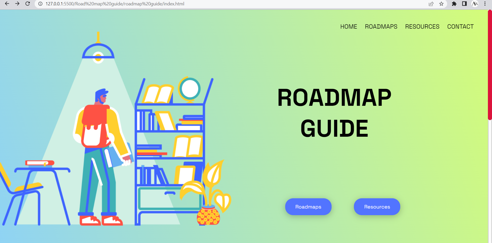

# Road Map Guide

A project made for Hackathon "HackNITR 4.0 ".

In this techie world, a newbie requires a guide or roadmap to help him choose a path for his coding journey. But when there are a lot of courses, the question comes which course is beneficial, which course should I pursue as a beginner or which language to learn first. Don't worry if you have all these questions we've got your back. To solve all queries of all level coders, here we are presenting "Road Map Guide" from Roadmaps to Resources to practice questions to installation all is here. We divided resources into different parts for users' convenience and further added documentation, courses, roadmaps, videos, project ideas.

